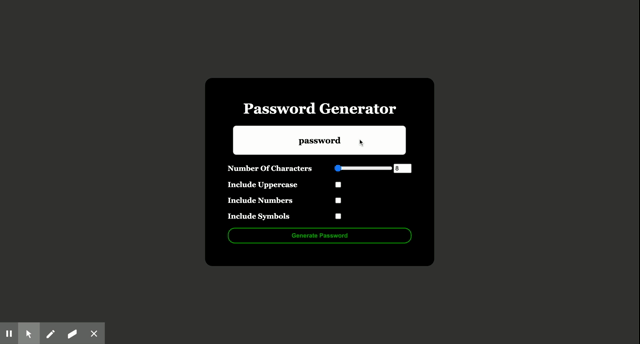

# password_generator 
This website will create a password for the user. 
It will make a password that ranges from 8 to 128 characters. 
You can use numbers, upper and lower case letters and special symbols.  
The user has the option to choose how many characters they want and what type of characters they want to use.
Hope you enjoy!

